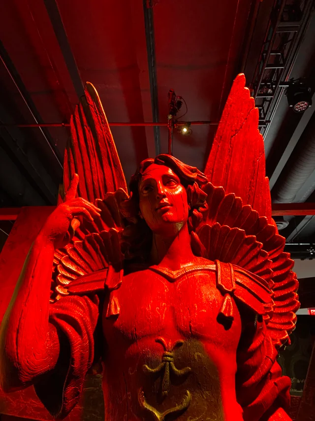
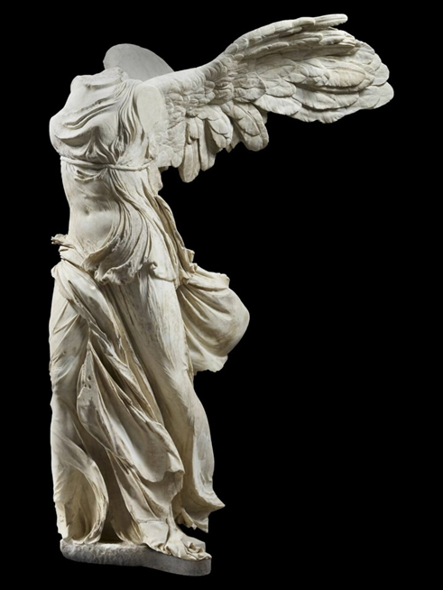
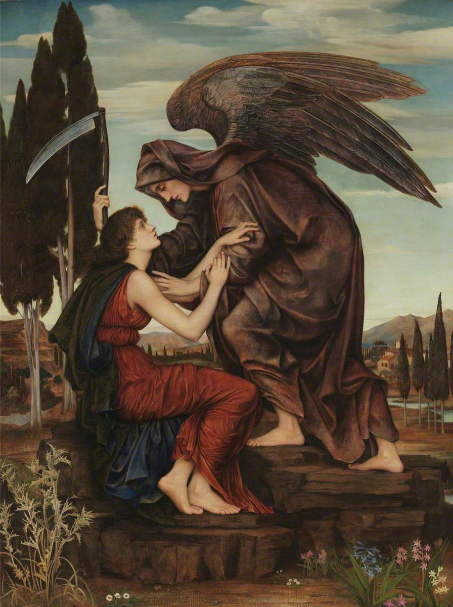

# Quiz 9: Final Assessment Project Pitch

> ⚠️ **Note:** I do not currently have a team assigned. The mechanics below are written as placeholder allocations and will be updated once I am placed in a group. For now, I have written for all four mechanics to demonstrate my understanding of the project direction.

## Part 1: Project Direction

**Path chosen:** Original piece.

### Vision (150 words max)

This project is an interactive digital artwork inspired by the **Dark Angel statue** from Guillermo del Toro's *Frankenstein* (2025), a blood-red, flame-wreathed perversion of a St. Michael archangel that haunts Victor's nightmares. I will render a brooding angelic figure against a swirling **marble painting** background, rich veins of crimson, charcoal, and gold that flow and shift like molten stone. The piece explores the tension between beauty and decay, stillness and chaos.

The marble textures draw from the centuries-old art of **Ebru (Turkish paper marbling)**, where pigments float on water and are combed into intricate, organic patterns. The sculptural centrepiece references **Hellenistic Greek sculpture**, dramatic poses, flowing drapery, and emotional intensity, fused with del Toro's gothic horror sensibility. The result is a living canvas where classical form dissolves into abstract turbulence, and the viewer's presence disturbs the surface.

### Inspiration Sources

**1. The Dark Angel, Guillermo del Toro's *Frankenstein* (2025, Netflix)**

The recurring archangel statue in Victor Frankenstein's nightmares, a double-winged figure that appears engulfed in flame, eventually revealing a skeletal face beneath its serene mask. Concept art by Guy Davis and Guillermo del Toro. This drives the central figure of my piece: a winged silhouette caught between divinity and destruction.

**2. Ebru / Turkish Paper Marbling**

The ancient technique of floating pigment on water and combing it into fluid, organic patterns. These swirling veins of colour inform my generative marble background, I aim to recreate this effect computationally using Perlin noise and layered colour fields.

**3. Hellenistic Greek Sculpture, *Winged Victory of Samothrace***

The dramatic forward motion, flowing stone drapery, and emotional intensity of Hellenistic sculpture (c. 190 BC, Louvre). This informs the pose and silhouette of the angel figure, monumental, mid-gesture, caught in wind.

**4. *Angel of Death* by Evelyn De Morgan (1881)**

A Pre-Raphaelite oil painting depicting the Angel of Death embracing a mortal figure, draped in flowing robes with massive wings. This painting reinforces the emotional tone of the project, the intimacy between mortality and divinity, and informs the mood and colour palette of the piece.

## Part 2: Mechanics

> **Team allocation:** To be confirmed once a group is assigned. Below, I've outlined all four mechanics as they relate to the project vision. Each will be owned by a different team member.

### 🎵 Mechanic 1: Audio
**Owner:** *TBC*

The audio mechanic uses the **frequency content and amplitude** of a dark ambient soundtrack to drive visual elements across the canvas. The audio will be analysed in real time, splitting the signal into low, mid, and high frequency bands. Low frequencies (bass rumbles, deep drones) will control the **pulse and scale of a glowing halo or aura** surrounding the angel figure, when the bass hits, the halo expands and brightens with warm crimson light, as though the statue is breathing fire. Mid-range frequencies will influence the **speed and turbulence of the marble veins** flowing in the background, causing them to swirl faster or slower in response to the music's texture. High frequencies (crackling sounds, sharp tones) will trigger **particle bursts**, small embers or sparks that scatter outward from the angel's wings, like fragments of burning stone. The user doesn't directly interact with this mechanic, instead, the audio creates a constantly shifting atmosphere that makes the piece feel alive and responsive, as though the Dark Angel's nightmare is unfolding in real time.

### ⏱️ Mechanic 2: Time-Based
**Owner:** Nush *(that's me)*

The time-based mechanic governs a **slow environmental cycle** that transforms the canvas over the duration of the experience. Using `setInterval` and elapsed-time tracking, the piece transitions through distinct visual phases that mirror the Dark Angel's arc in the film, from sacred stillness to fiery destruction. In the **first phase** (0 to 30 seconds), the palette is cool and muted: deep blues, marble greys, and soft gold. The angel figure is still, bathed in pale light. Marble veins drift gently. After 30 seconds, the piece enters a **transition phase**: warm tones begin bleeding in, amber, then crimson, and the marble background starts accelerating its movement. Subtle cracks appear across the canvas, rendered as thin dark lines that slowly propagate outward. By the **final phase** (60+ seconds), the canvas is dominated by reds and blacks, flames lick at the edges of the frame, and the angel's silhouette begins to fracture and fragment as though the stone is breaking apart. The cycle then loops, returning to calm. This mechanic gives the piece a **narrative rhythm**, it's not static, it tells a story of transformation and collapse over time, and every viewer who watches long enough sees the full arc unfold.

### 🌀 Mechanic 3: Perlin Noise & Randomness
**Owner:** *TBC*

This mechanic generates the **marble background**, the visual foundation of the entire piece. Perlin noise fields are layered to create the organic, flowing vein patterns that characterise real marble and Ebru paper marbling. Multiple octaves of 2D Perlin noise are sampled across the canvas, with each layer mapped to a different colour channel (crimson, charcoal, gold, ivory). The noise values determine the **colour, opacity, and thickness** of each marble vein. A random seed is generated at the start of each session, meaning every viewer sees a **unique marble pattern**, no two experiences are identical. The seed also determines the initial placement and curvature of the veins, ensuring visual variety while the Perlin noise ensures the patterns always feel organic rather than mechanical. As the time-based mechanic progresses through its phases, the noise parameters shift, the frequency increases (veins become tighter and more chaotic), and the amplitude grows (colours become more saturated and contrasted). The user doesn't directly control this mechanic, but it responds to the time cycle and audio input, making the marble surface feel like a living, breathing substrate beneath the angel. The combination of deterministic Perlin flow with randomised seeds creates a piece that is **procedurally unique but aesthetically coherent** every time it loads.

### 🖱️ Mechanic 4: User Input
**Owner:** *TBC*

The user input mechanic allows the viewer to **interact directly with the canvas** using mouse movement and clicks. As the mouse moves across the canvas, it creates a **disturbance ripple** in the marble surface, the veins near the cursor warp, bend, and flow away from the pointer, as though the viewer is dragging their hand through wet paint or disturbing the surface of water in an Ebru tray. The displacement effect is calculated based on the distance between the cursor and each marble vein point, with closer points being pushed further. This gives the viewer a tactile, almost physical connection to the artwork. **Clicking** triggers a more dramatic interaction: a burst of golden light radiates outward from the click point, momentarily illuminating the marble veins in bright gold before fading back. If the user clicks directly on or near the angel figure, the angel briefly **reacts**, its wings shift, its halo flares, or the cracks in its surface glow with inner fire. This creates a sense of consequence: the viewer isn't just observing the Dark Angel's nightmare, they are participating in it. **Keyboard input** (spacebar) allows the user to **freeze/unfreeze** the entire animation, pausing the time cycle, audio response, and marble flow so they can study the current state of the piece as a still composition. This dual interaction model, gentle mouse influence and decisive click events, gives the viewer both contemplative and active modes of engagement with the work.

## Part 3: Putting It Together

The four mechanics share a single full-screen canvas with the **angel silhouette** as the visual anchor at centre. The marble background (Perlin noise) serves as the foundational layer, constantly shifting beneath the figure. Time drives the macro narrative, a slow burn from calm to chaos and back, while audio adds micro-level responsiveness, making the marble pulse and the halo breathe. User input lets the viewer disturb this system, pushing marble veins and triggering light bursts that momentarily override the time cycle's palette. All mechanics read from shared state variables (current phase, colour palette, intensity level), ensuring visual coherence. The angel is the still point around which all chaos orbits.

*This pitch is a starting point, ideas will be refined as the build progresses and once a team is confirmed.*
